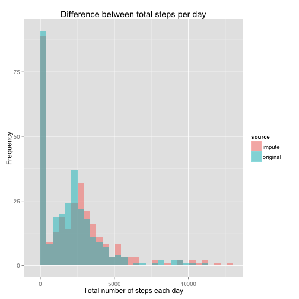
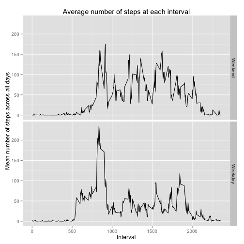

# Reproducible Research: Peer Assessment 1

It is now possible to collect a large amount of data about personal movement 
using activity monitoring devices such as a Fitbit, Nike Fuelband, or Jawbone 
Up. These type of devices are part of the “quantified self” movement – a group 
of enthusiasts who take measurements about themselves regularly to improve their
health, to find patterns in their behavior, or because they are tech geeks. But 
these data remain under-utilized both because the raw data are hard to obtain 
and there is a lack of statistical methods and software for processing and 
interpreting the data.

This assignment makes use of data from a personal activity monitoring device. 
This device collects data at 5 minute intervals through out the day. The data 
consists of two months of data from an anonymous individual collected during 
the months of October and November, 2012 and include the number of steps taken 
in 5 minute intervals each day.


## Loading and preprocessing the data
Unzip data file in working directory and load CSV file into memory. Removes CSV 
file once loaded into memory.


```r
zipFile <- "activity.zip"
unzip(zipFile)
dataFile <- "activity.csv"
data.all <- read.csv(dataFile)
unlink(dataFile)
```

Convert date column into date data type.


```r
data.all$date <- as.Date(data.all$date , format = "%Y-%m-%d")
```


## What is mean total number of steps taken per day?

### Total number of steps taken each day


```r
library('plyr')
## Create summary table with total number of steps each day
summary.stepsDay <- ddply(data.all, .(date), summarize, totalSteps = sum(steps, na.rm = TRUE))
```


```r
library('ggplot2')
## Plot summary data
figure.stepsDay <- ggplot(summary.stepsDay, aes(x = totalSteps)) + 
                   geom_histogram(fill="blue") + 
                   ggtitle("Frequency of total steps per day") +
                   xlab("Total number of steps each day") +
                   ylab("Frequency")

plot(figure.stepsDay)
```

```
## stat_bin: binwidth defaulted to range/30. Use 'binwidth = x' to adjust this.
```

 

### The mean and median total number of steps taken per day


```r
meanStepsDay <- mean(summary.stepsDay$totalSteps, na.rm = TRUE)
```
*Mean* number of steps per day: **9354.2295**


```r
medianStepsDay <- median(summary.stepsDay$totalSteps, na.rm = TRUE)
```
*Median* number of steps per day: **10395**


## What is the average daily activity pattern?

### Time series plot of the average number of steps taken at each interval


```r
library(ggplot2)
library(plyr)
summary.stepsInterval <- ddply(data.all, .(interval), summarize, 
                               meanSteps = mean(steps, na.rm = TRUE))

figure.stepsInterval <- ggplot(summary.stepsInterval, 
                               aes(x = interval, y = meanSteps)) + 
                        geom_line(color = "red") +
                        ggtitle("Average number of steps at each interval") +
                        xlab("Interval") +
                        ylab("Mean number of steps across all days")

plot(figure.stepsInterval)
```

 

### The five minute interval that on average contains the most number of steps


```r
summary.stepsIntervalMax <- summary.stepsInterval[which.max(summary.stepsInterval$meanSteps),]
intervalMax <- summary.stepsIntervalMax$interval
```
Five minute interval that on average contains the most number of steps is: **835**

## Imputing missing values

### Total number of missing values in the dataset (i.e. the total number of rows with NAs)


```r
naSum <- sum(is.na(data.all))
```
Total number of missing values in the dataset is: **2304**


### Replace missing values

Missing values are replaced with the mean for that interval.


```r
library('plyr')
impute.mean <- function(x) replace(x, is.na(x), mean(x, na.rm = TRUE))
data.impute <- ddply(data.all, ~interval, transform, steps = impute.mean(steps))
data.impute <- data.impute [order(data.impute $date), ]
```

### Histogram of the total number of steps taken each day


```r
library('plyr')
## Create summary table with total number of steps each day from imputted data
summary.stepsDayImpute <- ddply(data.impute, .(date), summarize, totalSteps = sum(steps, na.rm = TRUE))
```


```r
library('ggplot2')
## Plot summary data
figure.stepsDayImpute <- ggplot(summary.stepsDayImpute, aes(x = totalSteps)) + 
                   geom_histogram(fill="blue") + 
                   ggtitle("Frequency of total steps per day imputed") +
                   xlab("Total number of steps each day") +
                   ylab("Frequency")

plot(figure.stepsDayImpute)
```

```
## stat_bin: binwidth defaulted to range/30. Use 'binwidth = x' to adjust this.
```

 

### The mean and median total number of steps taken per day


```r
meanStepsDayImpute <- mean(summary.stepsDayImpute$totalSteps, na.rm = TRUE)
```
*Mean* number of steps per day imputed: **1.0766 &times; 10<sup>4</sup>**


```r
medianStepsDayImpute <- median(summary.stepsDayImpute$totalSteps, na.rm = TRUE)
```
*Median* number of steps per day imputed: **1.0766 &times; 10<sup>4</sup>**


### Does the imputed data differ from the orginal data?

Do these values differ from the estimates from the first part of the assignment? What is the impact of imputing missing data on the estimates of the total daily number of steps?


```r
library('ggplot2')
library('plyr')
## Combine data sets
data.all$source <- c("original")
data.impute$source <- c("impute")
data.combined <- rbind(data.all,data.impute)
## Create summary of combined data
summary.stepsDayCombined <- ddply(data.combined, .(source,interval), 
                                       summarize, totalSteps = sum(steps, na.rm = TRUE))

## Plot overlaided histograms
figure.stepsDayCombined <- ggplot(summary.stepsDayCombined, aes(x=totalSteps, fill=source)) + 
                         geom_histogram(alpha=.5, position="identity")  +                  
                         ggtitle("Difference between total steps per day") +
                         xlab("Total number of steps each day") +
                         ylab("Frequency")

plot(figure.stepsDayCombined)
```

```
## stat_bin: binwidth defaulted to range/30. Use 'binwidth = x' to adjust this.
```

 


```r
meanDiff <- mean(summary.stepsDayImpute$totalSteps, na.rm = TRUE) - mean(summary.stepsDay$totalSteps, na.rm = TRUE)
```
The *mean* number of steps per day from imputed data differs from the orignal by: **1411.9592**


```r
medianDiff <- median(summary.stepsDayImpute$totalSteps, na.rm = TRUE) - median(summary.stepsDay$totalSteps, na.rm = TRUE)
```
The *median* number of steps per day from imputed data differs from the orignal by: **371.1887**

*Imputing missing data on the estimates of the total daily number of steps smooths out the the distrubution a little.*

## Are there differences in activity patterns between weekdays and weekends?

Creating a new factor variable in the dataset with two levels – "weekday"" and
"weekend"" indicating whether a given date is a weekday or weekend day.


```r
## Assuming the dataset in question is the imputed datset rather than the 
## orginal 
library('chron')

data.all$weekend <- is.weekend(as.Date(data.all$date))
data.all$weekend <- factor(data.all$weekend, levels = c(TRUE,FALSE), labels = c("Weekend", "Weekday"))
```

Time series plot of  5-minute intervals and the average number of steps taken, 
averaged across all weekday days or weekend days.


```r
library('ggplot2')
library('plyr')
summary.stepsIntervalWeekend <- ddply(data.all, .(weekend,interval), summarize,
                                      meanSteps = mean(steps, na.rm = TRUE))

figure.stepsIntervalWeekend <- ggplot(summary.stepsIntervalWeekend, 
                                      aes(x = interval, y = meanSteps)) + 
                               geom_line() +
                               facet_grid(weekend ~ .) +
                               ggtitle("Average number of steps at each interval") +
                               xlab("Interval") +
                               ylab("Mean number of steps across all days")

plot(figure.stepsIntervalWeekend)
```

 


